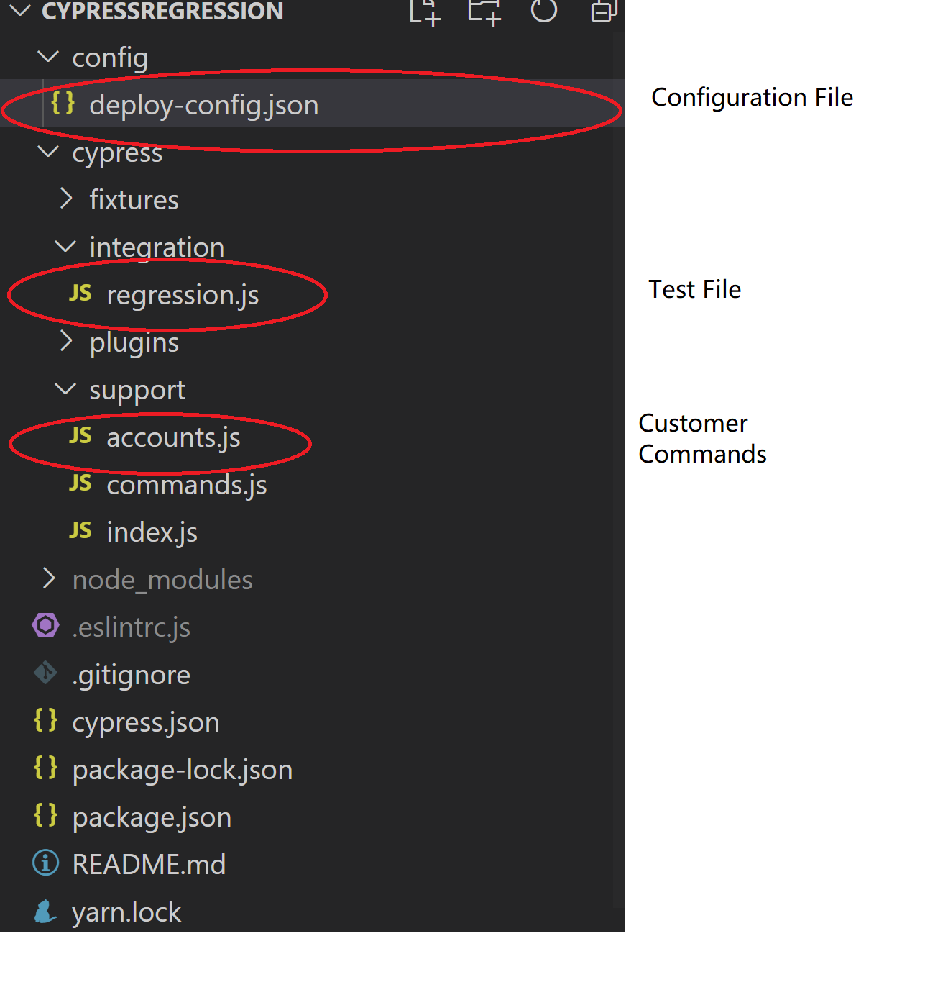

# Environment
>  1. Cypress package version >=  6.3.0
>  2. Node.js 10 or 12 and above
# Install Cypress
>  1. [Downloading and installing Node.js and npm](https://docs.npmjs.com/downloading-and-installing-node-js-and-npm) 
  
>  2. Install Cypress using ```npm install cypress --save-dev```

>  3. Run ```cypress -v``` to check if cyress is properly installed, if there are errors, please add ./bin folder to your system environment 

# How to run test
1. Clone the project ```git clone https://github.com/kettlescott/Cypress.git```

2. Enter the project folder

3. Run UI test using command ```cypress run --config-file config/deploy-config.json  --spec "cypress/integration/regression.js"```

3. Run API test using command ```cypress run --config-file config/deploy-config.json  --spec "cypress/integration/rest_test.js"```


## Framework Introduction
> The idea behind this framework is pretty straigtforward, I just follow the Cypress standard test by speficication
> I also added 3 customized commands into cypress command package, for more information please refer to [accounts.js](https://github.com/kettlescott/Cypress/blob/master/cypress/support/accounts.js) 

## Project structure


# Known Issues (Bugs and tests are expected to fail)
| UI Test| 
| ------------- |
| it("Bug : bounday test expected count larger than stocks", ()      |
| it("Bug : bounday test Quantity is a decimal value, total cost should be zero", ()|

| API Test| 
| ------------- |
| it("Bug POST invalid input", ()      |
| it("Bug : Delete Pet Invalid ID supplied string as input id", ()|
| it("Bug Put Pet not found", () |


## Update deploy-config.json
Configuration is under 
```javascript
{
    "env": {
        "Url": "petstore.octoperf.com",        
        "UserInfor": {
		    "account": "scwang",
            "accountPassword": "1234567"            
		},
        "LockedUserInfor": {
		    "account": "lockedUser",
            "accountPassword": "1234567"            
		},
        "Resturl" : "petstore.swagger.io/v2/pet"
    } 
}
```
> Two users are created for the suite , one is a normal user the another one is locked user.
> If you create you own users , please update this [configuration file] (https://github.com/kettlescott/Cypress.gituration)  

## Bugs 
> Bugs are listed under bug.pdf


